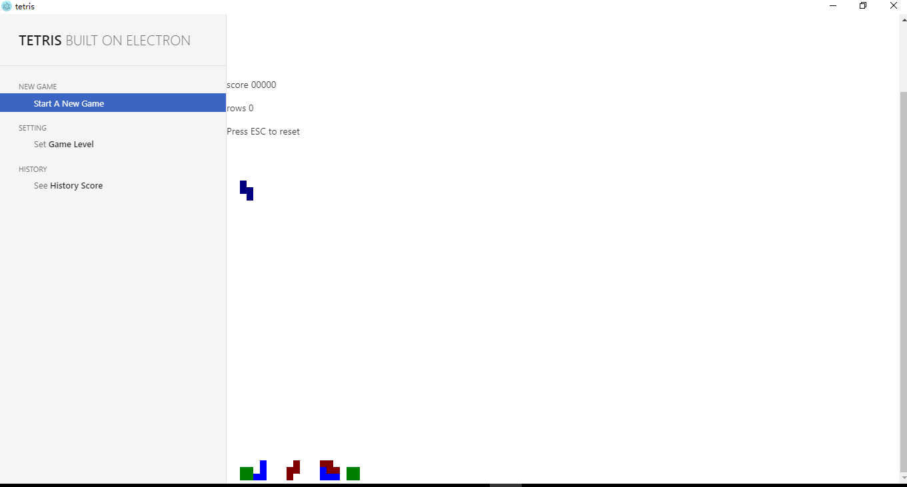

# Tetris

_A simple tetris game built with electron_

## How to use
- To install & start 
use the following commands in your terminal in the directory
```Powershell
npm install
```
and to start the app,use
```Powershell
npm start
```
- Further Development
  - modify the 'package.json' to add more dependencies and use 'npm install' to update your local repository.
  - modify the 'scripts' part in 'package.json' to let it support more commands.
  - uncomment ```win.webContents.openDevTools()``` in `main.js` for debugging
- TODO 
  - [x] basic tetris
  - [x] simple control panel 
  - [ ] shift between different difficulty levels 
  - [ ] see history scores

## Main pitfalls
- some improper names for functions and variables
- code not structured well
- not so good CSS(in fact I do not learn how to write good CSS file at first and copied some from the given exmample in Electron's doc)
- some uncaught exception which just will show if you do not open dev tools
- bad encapsulation for data structure and data process, not easy to refact and reading later
- bad function signatures

Just not going to devote too much time on this app, it is just a try for me to experience desktop app developing in electron, however there seems to be better solutions now for desktop app developing with based on nodejs. These pitfalls listed above may not be fixed in the future.

But I may add some new features to make it somewhat more similar to a normal tetris game....

Most of all, I have recently overcame something more fun than just developing some normal apps.

## demo


